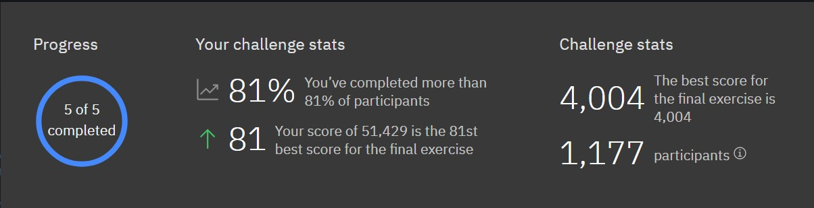

# IBM Quantum Challenge Nov 2020

## Challenge stats and my ranking:

## Description

#### Begins:
Nov 8 at 7:00 p.m. US EST
Nov 9 at 9:00 a.m. JST

#### Ends:  
Nov 29 at 6:59:59 p.m. EST
Nov 30 at 8:59:59 a.m. JST

We would like to welcome the global community to our third IBM Quantum Challenge this November, from the 8th through the 29th in the US / the 9th through the 30th in Japan. You will be presented with a new set of challenges designed to push the limits of our quantum systems towards another significant milestone.

Our [first IBM Quantum Challenge](https://ibmquantum.angelhack.com/) competitive coding contest was held in September 2019 and attracted seasoned and new coders alike from around the world to start their journey in Quantum Computing.

In [May 2020](https://www.ibm.com/blogs/research/2020/05/quantum-challenge-results/), we celebrated the fourth anniversary of IBM Quantum Experience with a second challenge that brought together 1,745 people from 45 countries. Their combined efforts led to the execution of over 1 billion circuits on 18 IBM Quantum systems in a single day.

Starting on November 8th at 7:00 p.m. US EST / November 9 at 9:00 a.m. JST, we will begin three weeks of challenges that will grow your quantum computing knowledge and skills as you use Qiskit to tackle a new set of exercises, each week.

If you are unfamiliar with our Quantum Challenge, please check out our previous challenges:

[September, 2019](https://github.com/quantum-challenge/2019/)
[May, 2020](https://github.com/qiskit-community/may4_challenge_exercises)

### Three Weeks of Programming for the Not-So-Distant Quantum Future

In this challenge, participants will get to learn and explore topics such as quantum data structures, which will become an essential component of quantum systems of larger scale.

### Week One: 
The first week of exercises that will be presented in this challenge is designed for beginners to learn the basics of quantum computation. You will also learn about the famous quantum algorithm, Grover’s algorithm, to explore its special properties. Although the material will cover the basics, novices will find the first week a good warm up session to get ready for the second week.

### Week Two: 
This week, participants will learn how to implement near-future quantum data structures and design a quantum game solver to be solved using Grover’s algorithm. This exercise not only builds on top of the first week’s exercises, but will also help prepare you for the third and final week. And I must tell you, if you can solve the second week that would be already quite impressive!

### Week Three: 
The exercises for the challenge’s final week will be significantly more difficult than the previous weeks’, so don’t worry if you get stuck tackling it. Participants will be asked to deal with a much more complicated data structure, and will be asked to solve a problem using Grover’s algorithm they learned in the previous weeks. Even an experienced quantum programmer will be challenged by this one. And if you do solve the problem, hats off to you!

### Acknowledgements

We are proud to announce our collaboration with Keio University once again to host this challenge. Special thanks to Drs. Takahiko Satoh and Shin Nishio for being an integral part of this challenge. [Read their inspiring story](https://medium.com/qiskit/announcing-the-next-ibm-quantum-challenge-where-you-can-build-the-not-so-distant-quantum-future-81457c3d0adc/), describing their personal journey in quantum computing, and contributions to this challenge.

And thanks to the global community of quantum enthusiasts out there who continue to inspire and encourage us to host these challenges!
